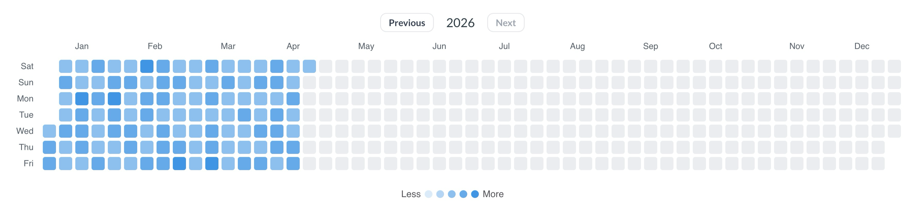

# @metabase/custom-viz-calendar-heatmap

<div>
  
  
  
</div>

A Calendar Heatmap custom visualization for Metabase. Renders a GitHub-style year calendar where each cell represents a day, colored by an aggregated metric value.

Requires Metabase `>= 62`.



## Data requirements

The query must return two columns:

- **Date column** (dimension) — used as the day for each cell.
- **Numeric column** (metric) — used to color each cell.

Rows must be aggregated by day; multiple rows with the same date will fail to render.

## Settings

| Setting       | Description                                                         |
| ------------- | ------------------------------------------------------------------- |
| Date column   | Date dimension column. Auto-selected from the first date column.    |
| Metric column | Numeric metric column. Auto-selected from the first numeric column. |
| Color         | Base color used to build the heatmap scale.                         |
| Cell Shape    | Square, rounded, or circle.                                         |

## Development

```bash
npm install
npm run dev         # watch build + preview
npm run build       # compiles src/ → dist/, then packages it into a .tgz
```

`npm run build` writes `<name>-<version>.tgz` to the project root. Upload that file in **Admin → Custom visualizations → Add** to register the plugin.

> The packaged archive contains `metabase-plugin.json` plus the build output (`dist/index.js` and any whitelisted `dist/assets/*`).

## Other scripts

```bash
npm run prettier    # format
npm run type-check  # tsc --noEmit
```
